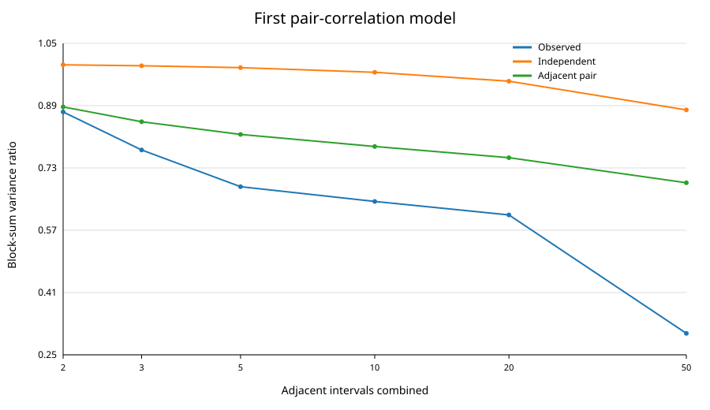
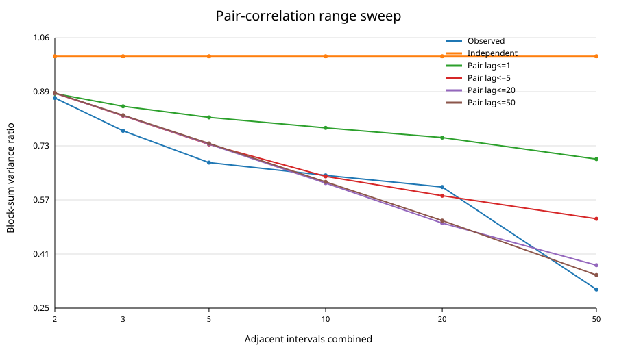
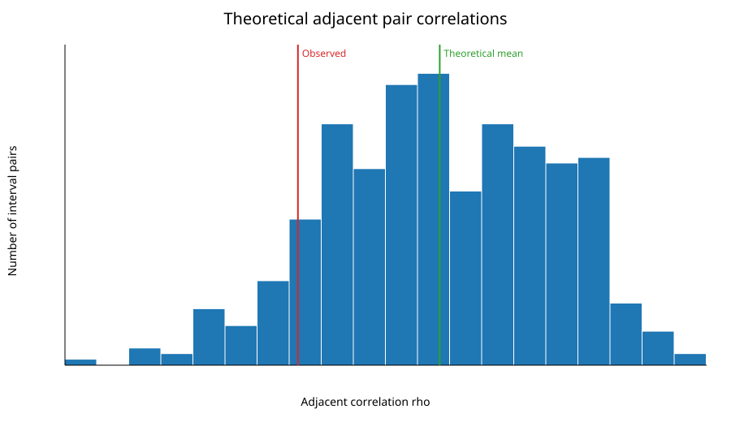

# الرسوم الموثقة للتجارب

هذا المجلد مخصص للرسوم التي تنتج عن التجارب الموثقة في `experiments/`.

## تجربة نموذج الارتباط الزوجي

التقرير المرتبط:

- [`../PAIR_CORRELATION_MODEL_EXPERIMENT.md`](../PAIR_CORRELATION_MODEL_EXPERIMENT.md)

الرسوم:

### 1. مقارنة النموذج الزوجي الأول مع نموذج الاستقلال

الملف:

- [`pair_correlation_block_variance_comparison.svg`](pair_correlation_block_variance_comparison.svg)

### 2. توسيع مدى علاقات الأزواج حتى 50 فترة

الملف:

- [`pair_correlation_range_sweep.svg`](pair_correlation_range_sweep.svg)

### 3. توزيع معاملات الارتباط النظرية للأزواج المتجاورة

الملف:

- [`pair_correlation_rho_distribution.svg`](pair_correlation_rho_distribution.svg)

## قاعدة التوثيق

عندما تنتج تجربة رسمًا يستخدم في الاستنتاج أو المقارنة، يجب حفظ نسخة قابلة للعرض داخل المستودع وربطها بالتقرير أو بهذا الفهرس، حتى لا تبقى الرسوم محصورة في ملفات الجلسة المحلية.
