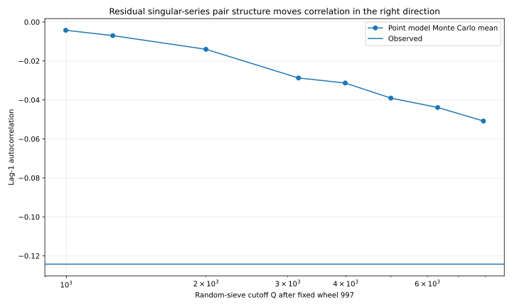
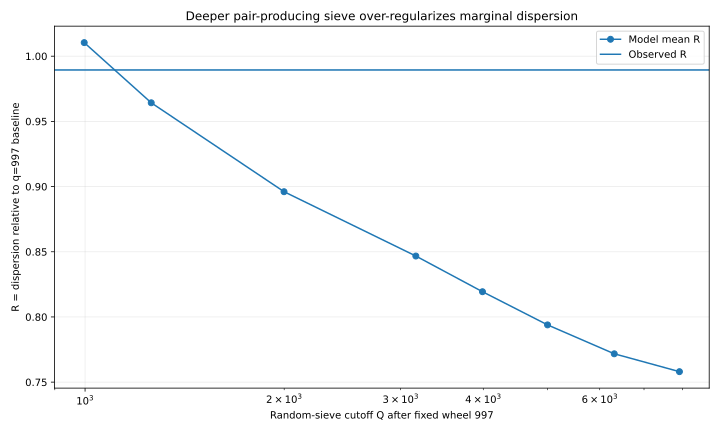
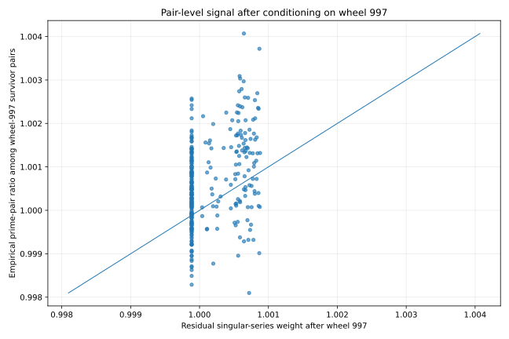

# الرسوم الموثقة للتجارب

هذا المجلد مخصص للرسوم التي تنتج عن التجارب الموثقة في `experiments/`.

## تجربة نموذج الارتباط الزوجي

التقرير المرتبط:

- [`../PAIR_CORRELATION_MODEL_EXPERIMENT.md`](../PAIR_CORRELATION_MODEL_EXPERIMENT.md)

الرسوم:

### 1. مقارنة النموذج الزوجي الأول مع نموذج الاستقلال

الملف:

- [`pair_correlation_block_variance_comparison.svg`](pair_correlation_block_variance_comparison.svg)

### 2. توسيع مدى علاقات الأزواج حتى 50 فترة

الملف:

- [`pair_correlation_range_sweep.svg`](pair_correlation_range_sweep.svg)

### 3. توزيع معاملات الارتباط النظرية للأزواج المتجاورة

الملف:

- [`pair_correlation_rho_distribution.svg`](pair_correlation_rho_distribution.svg)

## تجربة نموذج Hardy–Littlewood النقطي بعد عجلة 997

التقرير المرتبط:

- [`../HL_SINGULAR_SERIES_POINT_MODEL.md`](../HL_SINGULAR_SERIES_POINT_MODEL.md)

الرسوم:

### 1. تطور الارتباط المتتالي مع تعميق الغربلة العشوائية

الملف:

- [`hl_point_model_lag1_progression.svg`](hl_point_model_lag1_progression.svg)

يبين أن ذيل `singular series` بعد عجلة 997 يدفع الارتباط في الاتجاه السلبي الصحيح، لكنه لا يصل إلى الارتباط المرصود.

### 2. تطور التشتت مع تعميق الغربلة العشوائية

الملف:

- [`hl_point_model_dispersion_progression.svg`](hl_point_model_dispersion_progression.svg)

يبين المقايضة التي ظهرت في التجربة: الارتباط يتحسن في اتجاه البيانات، بينما يصبح التشتت أصغر من الواقع مع زيادة `Q`.

### 3. فحص مباشر لوزن الأزواج المتبقي بعد عجلة 997

الملف:

- [`hl_residual_pair_weight_check.svg`](hl_residual_pair_weight_check.svg)

يقارن النسبة التجريبية لأزواج الأوليات بين ناجي عجلة 997 بالوزن النظري المتبقي لـ`singular series` حسب المسافة `h`.

## قاعدة التوثيق

عندما تنتج تجربة رسمًا يستخدم في الاستنتاج أو المقارنة، يجب حفظ نسخة قابلة للعرض داخل المستودع وربطها بالتقرير أو بهذا الفهرس، حتى لا تبقى الرسوم محصورة في ملفات الجلسة المحلية.
